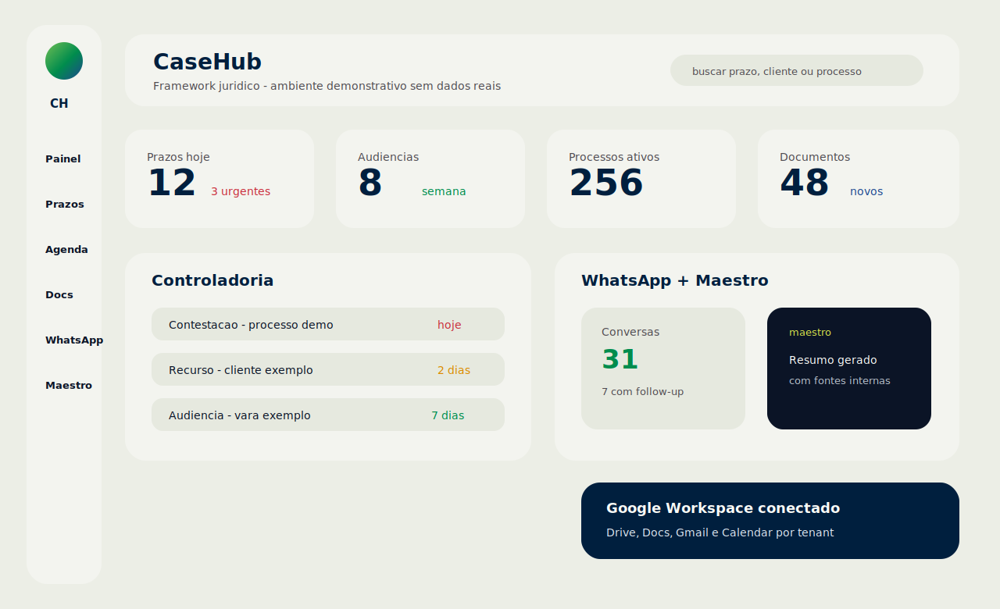
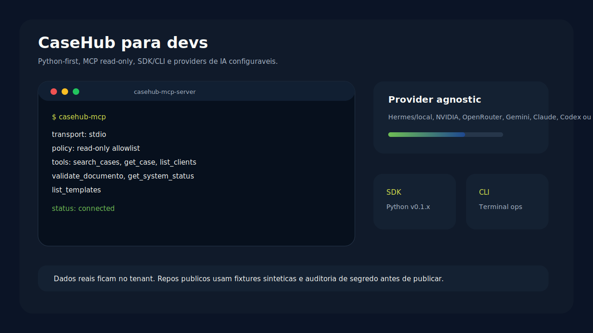

# CaseHub

**Versao publica:** `0.9.12-alpha`
**Data do snapshot:** 2026-06-23
**Estado:** alpha em desenvolvimento ativo, com acesso manual para escritorios.

CaseHub e um framework juridico para escritorios brasileiros: prazos,
processos, documentos, agenda, comunicacao e IA contextual no mesmo ambiente.
Este repositorio publico e um snapshot sanitizado do produto alpha, sem dados de
clientes, segredos, sessoes WhatsApp, uploads, logs, backups ou topologia de
producao.

## Demo

- Site publico: https://casehub.legal
- Acesso ao produto alpha: liberado manualmente para escritorios aprovados.
- Mockups demonstrativos sem dados reais:





## O que existe no alpha

- Controladoria juridica: prazos fatais, responsaveis, fontes e status.
- Agenda: compromissos, audiencias, tarefas e sincronizacao Google Calendar.
- Kanban: tarefas, anexos, multi-responsavel e arquivamento reversivel.
- Clientes e processos: cadastro, historico, documentos e filtros.
- Documentos: Drive, Docs, upload, modelos e trilha de auditoria.
- Gmail/SMTP: leitura, envio, integracoes e configuracao por tenant.
- WhatsApp Chat: conversas, midia, follow-up, avatar e proxy multi-tenant.
- WhatsApp Bot: `whatsapp-web.js`, sessoes isoladas por org e HMAC inbound.
- Maestro: assistente contextual, com politica de IA por escritorio.
- Work Intelligence: eventos agregados e opt-in para metricas operacionais.
- MCP/SDK/CLI: superficies para agentes, scripts e terminal.

## IA e provedores

CaseHub nao depende de um unico provedor de IA. A camada Maestro pode ser
configurada por escritorio conforme politica de dados, custo e preferencia:

- local/self-hosted, incluindo modelos estilo Hermes via runtime compativel;
- NVIDIA API;
- OpenRouter ou gateway compativel;
- Gemini;
- Claude, Codex, GLM ou outro provedor via adaptador apropriado.

Dados reais de clientes nao devem sair do tenant sem configuracao explicita,
base legal e politica do escritorio. Repos publicos devem usar apenas fixtures
sinteticas.

## MCP, SDK e CLI

Projetos relacionados mantidos localmente:

| Projeto | Versao atual | Estado |
| --- | --- | --- |
| `casehub-mcp-server` | `0.2.0` | MCP stdio, read-only, 6 ferramentas allowlisted |
| `casehub-sdk-py` | `0.1.x` | SDK Python em WIP |
| `casehub-cli` | `0.1.x` | CLI em WIP sobre o SDK |

Ferramentas MCP documentadas no v0.2:

- `search_cases`
- `get_case`
- `list_clients`
- `validate_documento`
- `get_system_status`
- `list_templates`

## Quick Start

### Docker

```bash
git clone https://github.com/mrfaillol/casehub.git
cd casehub
cp .env.example .env
docker compose -f docker-compose.yml -f docker-compose.lite.yml up --build
```

Abra http://localhost:8001/casehub.

### Local

```bash
python3.12 -m venv venv
source venv/bin/activate
pip install -r requirements.txt
cp .env.example .env
make dev-lite
```

Requisitos principais:

- Python 3.12+
- PostgreSQL 15+
- Redis 7 opcional
- Node.js 20+ para o bot WhatsApp

## Configuracao minima

| Variavel | Uso |
| --- | --- |
| `SECRET_KEY` | Assinatura de sessoes e tokens |
| `DATABASE_URL` | Banco PostgreSQL |
| `ADMIN_EMAIL` | Admin inicial |
| `CASEHUB_PRODUCT` | `lite`, `immigration` ou `whitelabel` |
| `PREFIX` | Prefixo HTTP, padrao `/casehub` |

Integracoes opcionais usam variaveis por provedor, por exemplo
`GOOGLE_*`, `GMAIL_*`, `OPENROUTER_API_KEY`, `NVIDIA_API_KEY`,
`GEMINI_API_KEY`, `SMTP_*`, `PDPJ_*`, `CALENDLY_*`, `NOTION_*` e
`CASEHUB_INBOUND_HMAC_SECRET`.

## Estrutura

```text
casehub/
|-- app.py
|-- core/                 # app factory, assets, runtime Jinja, flags
|-- middleware/           # tenant, permissoes, rate limit
|-- models/               # SQLAlchemy
|-- routes/               # FastAPI routers
|-- services/             # dominio e integracoes
|-- templates/            # Jinja
|-- static/               # CSS, JS, brand kit
|-- migrations/           # SQL idempotente
|-- services/whatsapp-bot # bot Node.js
|-- docs/
`-- tests/
```

## Politica do repositorio publico

Antes de publicar qualquer mudanca:

- rodar scan de segredo e PII;
- remover logs, uploads, backups, caches, sessoes e dados de cliente;
- usar apenas dados demonstrativos;
- nao commitar `.env`, credenciais Google, tokens WhatsApp, `.wwebjs_auth`,
  dumps de banco, screenshots reais com nomes ou artefatos de VPS.

## Documentacao

- [Arquitetura](docs/ARCHITECTURE.md)
- [Setup local](docs/DEVELOPER_SETUP.md)
- [API](docs/API_REFERENCE.md)
- [Manual do usuario](docs/USER_MANUAL.md)
- [White-label](docs/WHITE_LABEL_GUIDE.md)
- [Hardware](docs/HARDWARE_REQUIREMENTS.md)
- [Security](SECURITY.md)

## Licenca

Este snapshot publico nao inclui um arquivo `LICENSE`. Ate que uma licenca seja
adicionada, nao assuma permissao de uso comercial, redistribuicao ou hospedagem
de uma instancia derivada fora dos termos combinados com os mantenedores.
